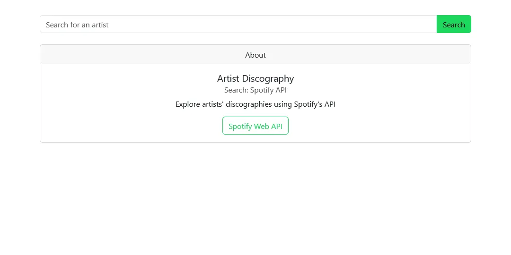
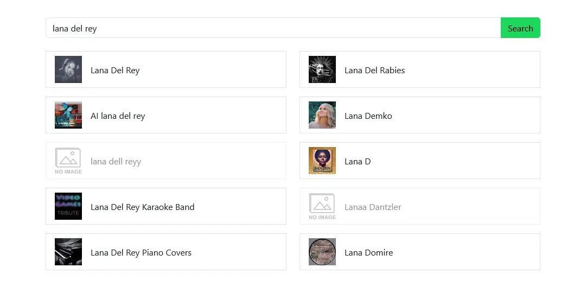
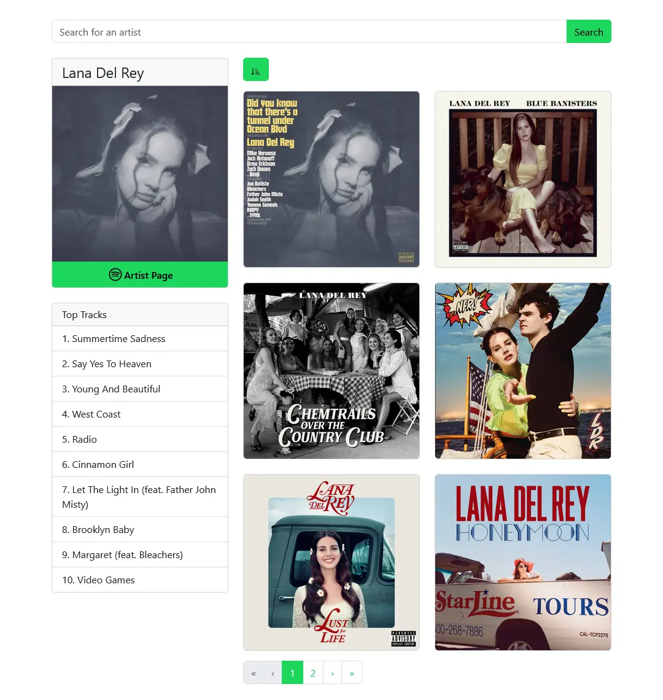
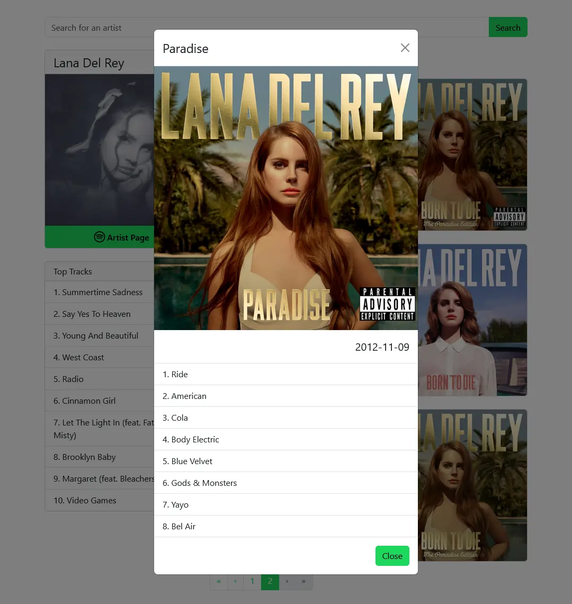

<div align="center">
  
  <h1>Artist Discography</h1>
  <p>
    Discover Every Beat: Your Journey Through Artists' Discographies Awaits!
  </p>
  <h4>
    <a href="https://github.ashthe.dev/spotify-artist-search/">View Demo</a>
    &emsp;&emsp;
    <a href="https://github.com/AshtonHeald/spotify-artist-search/issues/new">Report Bug</a>
  </h4>
</div>

## Table of Contents

 - [About](#about)
    * [Screenshots](#screenshots)
    * [Description](#description)
    * [Features](#features)
    * [Tech Stack](#tech-stack)
- [Getting Started](#getting-started)
    * [Prerequisites](#prerequisites)
    * [Installaton](#installation)
    * [Configuration](#configuration)
    * [Development](#development)
    * [Deployment](#deployment)
- [License](#license)

<!-- About -->
##  About
### Screenshots
  
|||
|:---:|:---:|
|||

### Description
  <p>Artist Discography is a web application powered by the Spotify Web API, designed to provide users with detailed insights into the discographies of their favorite artists. It offers functionalities for searching artists, exploring their complete discographies, and interacting with album details.</p>

> [!NOTE]
>The availability of data is subject to the Spotify database. Some albums, artists, or other data may not be available if they are not present in the Spotify database.

### Features

<dl>
  <dt>Artist Search</dt>
  <dd>Utilizes the Spotify Web API's search functionality to enable users to search for artists by name.</dd>
  <dt>Discography Overview</dt>
  <dd>Presents a comprehensive view of an artist's discography, including albums and top tracks.</dd>
  <dt>Album Sorting</dt>
  <dd>Allows users to sort the discography in ascending or descending order by release date, facilitating ease of exploration</dd>
  <dt>Albums Modal</dt>
  <dd>Provides a modal window for each album, showcasing album cover, release date, and tracklist details upon selection.</dd>
  <dt>Album Pagination</dt>
  <dd>Implements pagination for albums, displaying six albums per page to enhance navigation through extensive discographies.</dd>
</dl>

### Tech Stack

| Client | Server | DevOps |
|--------|--------|--------|
| [React](https://react.dev)  | Github Pages | Github Actions |
| [React Bootstrap](https://react-bootstrap.netlify.app/)  | | |
| [React Icons](https://react-icons.github.io/react-icons/) | | |
| [Axios](https://axios-http.com/)  | | |

<!-- Getting Started -->
##  Getting Started
### Prerequisites
This project uses pnpm as package manager
```bash
 npm install --global pnpm
```

### Installation

Clone the repository
```bash
git clone https://github.com/AshtonHeald/spotify-artist-search.git
```

Install dependencies
```
pnpm install
```

### Configuration

Environment Variables: To run this project, ensure you've added the necessary environment variables to your `.env` file. Replace `Client ID` and `Client Secret` with your own credentials. [Spotify Developer Dashboard](https://developer.spotify.com/dashboard)
```
VITE_CLIENT_ID=Client ID
VITE_CLIENT_SECRET=Client Secret
```

### Development

Start Vite dev server in the current directory.
```bash
pnpm run dev
```

Locally preview the production build. Do not use this as a production server as it's not designed for it.
```bash
pnpm run preview
```

### Deployment

Build for production. [Static Deploy](https://vitejs.dev/guide/static-deploy.html)
```bash
pnpm run build
```

---


<!-- Licence -->
### License

Distributed under the MIT License. See `LICENSE.md` for more information.

